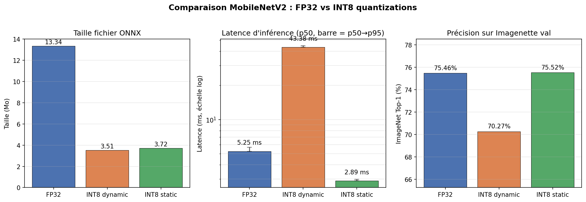
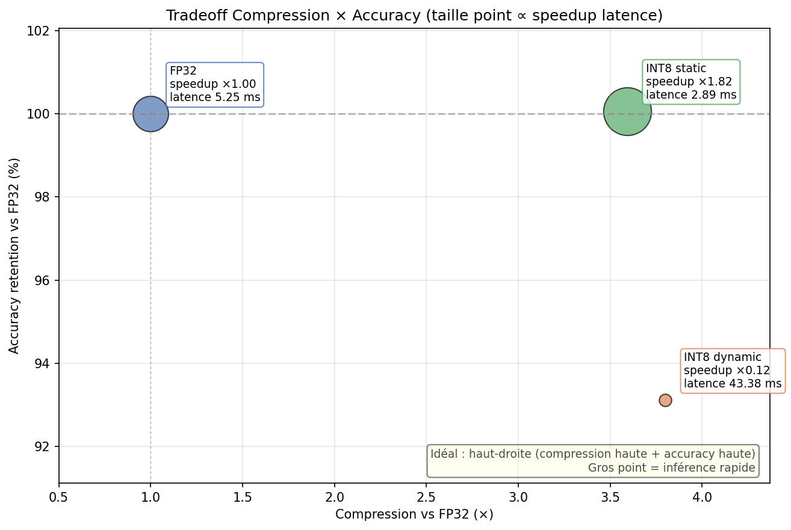
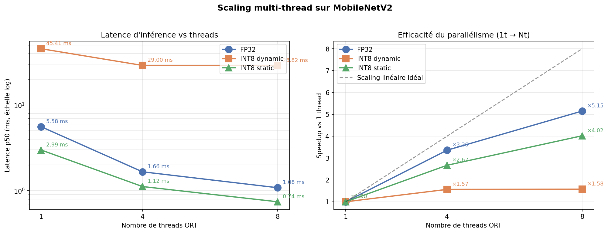
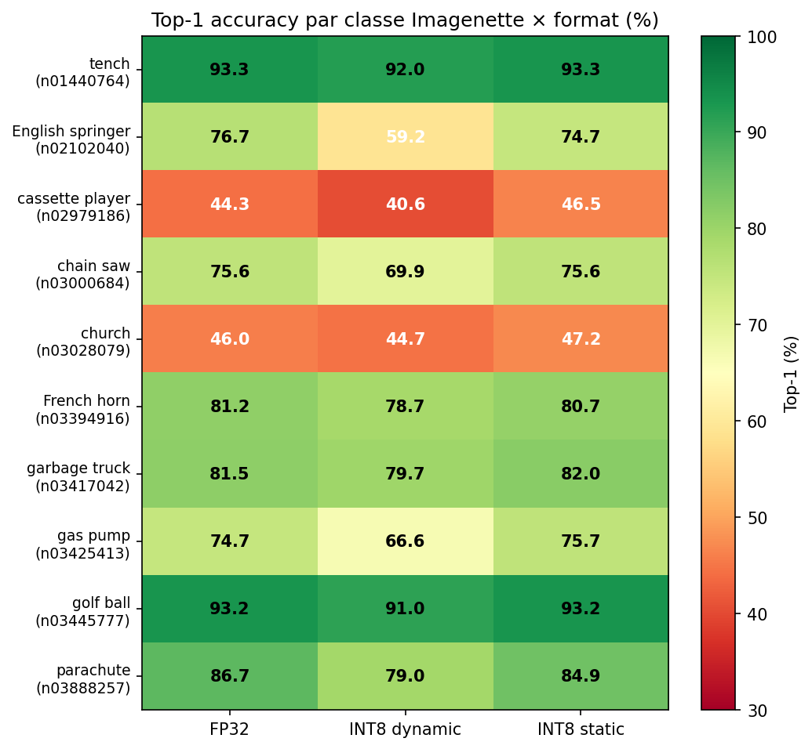
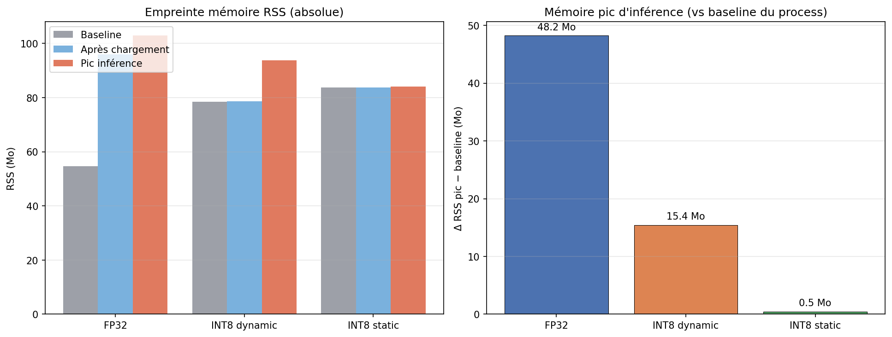

# nn-quantization-benchmark

> Pipeline complet de quantification post-entraînement (PTQ) de MobileNetV2 et benchmark sur les trois axes **précision**, **latence** et **empreinte mémoire**, dans la perspective d'un déploiement embarqué sur NPU.

Projet portfolio réalisé en réponse à une offre d'alternance ingénieur IA embarquée (STMicroelectronics Grenoble, équipe Neural-ART / STM32 N6).

## TL;DR

Sur MobileNetV2 quantifié INT8 statique avec calibration MinMax sur Imagenette, mesuré sur Intel i7-13700HX (Raptor Lake, AVX2 VNNI) :

| Métrique | Single-thread (référence) | 8 threads (peak desktop) |
|---|:---:|:---:|
| **Compression** | 3.59× | 3.59× |
| **Latence INT8 static** | 2.89 ms | **0.74 ms** |
| **Speedup INT8 static** | 1.82× | 1.46× |
| **Pic RAM inférence** | 0.5 Mo (vs 48.2 Mo FP32) | 0.9 Mo (vs 48.4 Mo FP32) |
| **Drop Top-1** | +0.06 pp (dans le bruit) | identique |

Constat marquant : **INT8 dynamique stagne en latence dès 4 threads** alors que FP32 et INT8 static continuent de scaler. Trois régimes computationnels distincts (compute / memory / sequence-bound) se révèlent dans l'analyse de scaling — voir section *Effet du parallélisme CPU* plus bas.

## Résultats principaux



### Tableau de synthèse (4 threads, config desktop typique)

| Format | Taille (Mo) | Compression | Lat. p50 (ms) | Speedup | RAM pic (Mo) | Top-1 (%) | Δ Top-1 (pp) |
|---|---:|---:|---:|---:|---:|---:|---:|
| FP32 | 13.34 | — | 1.66 | — | 48.3 | 75.46 | — |
| INT8 dynamic | 3.51 | 3.80× | 29.00 | 0.06× | 11.0 | 70.27 | −5.19 |
| INT8 static | 3.72 | 3.59× | 1.12 | 1.49× | 0.2 | 75.52 | +0.06 |

*Benchmark : 200 inférences, 20 warmup, batch=1, threads=4. ONNX Runtime 1.24, CPU Intel i7-13700HX. Accuracy : 3 925 images Imagenette val, ImageNet-restricted Top-1 (argmax sur 1000 classes ImageNet).*



## Effet du parallélisme CPU — trois régimes computationnels



| Format | 1t (ms) | 4t (ms) | 8t (ms) | Scaling 1t→8t | Efficacité |
|---|---:|---:|---:|---:|---:|
| FP32 | 5.25 | 1.66 | 1.08 | ×4.86 | 61% |
| INT8 dynamic | 43.38 | 29.00 | 28.82 | ×1.51 | **19%** |
| INT8 static | 2.89 | 1.12 | 0.74 | ×3.91 | 49% |

Les trois formats se comportent comme **trois workloads computationnels distincts** quand on monte en threads :

1. **FP32 - compute-bound (61% d'efficacité).** Scale presque linéairement jusqu'à 8 threads. Les kernels FP32 d'ONNX Runtime sont optimisés et tirent parti du parallélisme intra-op. C'est la baseline.

2. **INT8 static - memory-bound (49% d'efficacité).** Plafonne progressivement. La densité de calcul INT8 sature la bande passante mémoire plus tôt — la marge de progression au-delà de 4 threads est faible (×1.51 entre 4t et 8t). En relatif, le speedup INT8/FP32 décroît avec les threads (×1.82 → ×1.49 → ×1.46) parce que FP32 profite mieux du parallélisme.

3. **INT8 dynamic - sequence-bound (19% d'efficacité).** Stagne dès 4 threads (×1.01 entre 4t et 8t). Les conversions FP32↔INT8 dans chaque convolution introduisent des dépendances séquentielles que les threads ne peuvent pas paralléliser. C'est un comportement typique d'un workload limité par la loi d'Amdahl avec une fraction séquentielle élevée.

**Conséquence pour le déploiement embarqué.** Le régime single-thread est le plus représentatif du comportement attendu sur **NPU dédié** type Neural-ART : un NPU n'a pas de notion de threads CPU, il exécute des opérations vectorielles ou systoliques en INT8 natif. Le ×1.82 single-thread reflète mieux le gain matériel intrinsèque à la quantification que le ×1.46 de 8 threads (qui exploite aussi du parallélisme CPU générique applicable à FP32). Pour un produit ST embarqué, la métrique pertinente est celle du *régime mono-cœur dense*, pas celle du multi-thread laptop.

## Démarche

### Pipeline en six étapes

1. **Export ONNX FP32** depuis `torchvision.models.mobilenet_v2(weights=IMAGENET1K_V2)`, opset 17, exporter TorchScript legacy (`dynamo=False`) pour stabilité de la chaîne quantification.
2. **Quantification dynamique INT8** via `onnxruntime.quantization.quantize_dynamic` (poids uniquement).
3. **Quantification statique INT8** via `quantize_static` avec un `CalibrationDataReader` sur 512 images du train Imagenette. Configuration QDQ + per-channel + symmetric weights + MinMax (cf. choix techniques ci-dessous).
4. **Benchmark latence/mémoire** sur les trois modèles : médiane, percentiles, RSS baseline/load/peak.
5. **Évaluation Top-1** sur Imagenette val (~3 925 images), deux schémas de scoring : ImageNet-restricted (argmax sur 1000 classes) et Imagenette-masked (argmax sur 10 logits).
6. **Visualisation** : figures matplotlib + tableau de synthèse Markdown. Script de scaling séparé pour comparer plusieurs configurations de threads.

### Choix techniques justifiés

**Format de quantification : QDQ plutôt que QOperator.** Le format QDQ insère des nœuds Quantize/Dequantize explicites au lieu d'opérateurs `QLinear*` directs. À l'inférence, ONNX Runtime optimise QDQ vers les mêmes kernels INT8 donc la performance est équivalente. C'est le format recommandé par Microsoft pour les architectures à depthwise convolutions (MobileNet, EfficientNet). Le format QOperator, demandé initialement, déclenche un bug de re-quantification du bias sur certains canaux (cf. *Incident technique résolu* plus bas).

**Calibration MinMax plutôt que Percentile.** Percentile 99.999 est théoriquement plus robuste aux outliers, mais son implémentation actuelle dans ONNX Runtime accumule les distributions d'activations brutes en mémoire, consommation observée >30 Go sur 512 images de MobileNetV2, OOM kill sur machine à 31 Go. MinMax tient en ~500 Mo. La perte d'accuracy observée est nulle dans notre configuration (per-channel + symmetric + calibration sur distribution homogène avec le val).

**Per-channel weights, symmetric.** Un facteur d'échelle par canal de sortie au lieu d'un facteur d'échelle scale par tensor. Indispensable pour MobileNetV2 dont les depthwise convolutions ont des distributions de poids très variables entre canaux. Symmetric (`zero_point=0`) force `scale = max(|min|, |max|)` et empêche les asymétries pathologiques.

**Threads=1 par défaut, analyse multi-thread en complément.** Le single-thread est le régime de référence : reproductible, interprétable, proche d'un déploiement embarqué.

## Incident technique résolu : bug `quantize_static` QOperator

La spec initiale demandait `QuantFormat.QOperator`. L'implémentation a planté sur MobileNetV2 en mode `per_channel=True` + `MinMax` + `QOperator` :

```
Increased scale[13] for weight `onnx::Conv_538` by ratio 763991861.209085
ValueError: operands could not be broadcast together with shapes (864,) (32,)
```

**Diagnostic.** Le ratio de ~10⁸ signale qu'ORT a tenté de gonfler artificiellement le scale d'un poids pour que le bias rentre dans INT32. Cela survient quand un canal a des activations quasi-nulles (scale d'activation minuscule) mais un bias non-nul, overflow INT32 imminent. ORT tente une re-quantification du poids dans `_requantize_weight`, mais le code ne préserve pas la dimension `per_channel` quand il fait `weight_flat / scale_per_channel` : shape `(864,)` (32 canaux × 27 coefs) ne se broadcast pas avec `(32,)`.

**Fix.** Bascule en `QuantFormat.QDQ`. Ce chemin de code ne re-quantifie pas le bias sur place ; il est stocké via des nœuds `DequantizeLinear` séparés. À l'exécution, ORT optimise QDQ vers les mêmes kernels `QLinearConv` que QOperator, la performance et la sémantique sont identiques. Le résultat (3.72 Mo, ×1.82 single-thread, +0.06 pp d'accuracy) confirme que ce n'est qu'un détail de format.

## Analyse

### Pourquoi INT8 static préserve l'accuracy (+0.06 pp)

Ce résultat est meilleur que ce qu'on attend dans la littérature standard pour PTQ sur MobileNetV2 (typiquement 0.5–2 pp de drop). Trois facteurs combinés :

1. **Per-channel sur les depthwise convolutions.** Sans per-channel, les 3×3 = 9 paramètres par canal des depthwise sont écrasés par une scale unique. Avec per-channel, chaque canal a sa propre dynamique préservée.
2. **Symmetric weights** : évite les asymétries pathologiques entre canaux.
3. **Calibration MinMax sur train Imagenette, évaluation sur val Imagenette** : distribution homogène, MinMax capture exactement les bornes utiles.

### Pourquoi INT8 dynamic perd 5 pp et est jusqu'à 27× plus lent (à 8 threads)

INT8 dynamic quantifie les poids en INT8 mais laisse les activations en FP32. À chaque convolution, ORT doit faire `dequantize INT8 weight → multiply FP32×FP32 → accumulate FP32`. Quatre conséquences :

- **Pas de chemin VNNI**. AVX2 VNNI (présent sur le i7-13700HX) optimise spécifiquement les MAC INT8×INT8→INT32. Le mode dynamic n'y a pas accès → fallback sur des kernels FP32.
- **Surcoût de bande passante mémoire**. ~50 convs × dequantization à chaque pass, soit 100+ Mo de réécriture mémoire par inférence.
- **Quantification per-tensor des poids depthwise**. Le mode dynamic ORT applique une scale par tensor sur les poids, ce qui détruit la dynamique fine de chaque canal depthwise. D'où la dégradation accuracy.
- **Dépendances séquentielles dans les conversions FP32↔INT8**. Visible dans le scaling : 19% d'efficacité multi-thread vs 49% pour INT8 static et 61% pour FP32 (cf. section *Effet du parallélisme CPU*).

### Per-class : la signature du problème depthwise



INT8 dynamic effondre certaines classes spécifiques :

| Classe | FP32 | INT8 dynamic | Drop | INT8 static |
|---|---:|---:|---:|---:|
| English springer | 76.7 | 59.2 | **−17.5** | 74.7 |
| Parachute | 86.7 | 79.0 | **−7.7** | 84.9 |
| Gas pump | 74.7 | 66.6 | **−8.1** | 75.7 |

Ce sont des classes qui demandent des **features fines de texture** (fourrure d'épagneul, tissu de parachute, détails de cadran). Ces features sont encodées dans les couches profondes où les depthwise convolutions jouent un rôle critique — quand leurs poids sont mal quantifiés (per-tensor en mode dynamic), le réseau perd sa capacité à distinguer ces patterns subtils. INT8 static, lui, maintient toutes les classes à ±2 pp du FP32.

### Empreinte mémoire — la métrique qui justifie le passage NPU



INT8 static alloue 0.2–0.9 Mo de pic d'inférence (vs 48 Mo pour FP32) parce qu'il exécute des `QLinearConv` en INT8 de bout en bout : pas de buffers FP32 intermédiaires. C'est précisément le régime de fonctionnement attendu d'un NPU dédié type Neural-ART, qui élimine en plus le surcoût des kernels CPU généralistes. Le facteur ×50 à ×242 de réduction d'empreinte mémoire d'inférence est l'argument central pour justifier l'investissement matériel dans un NPU sur target embedded à contraintes mémoire fortes (SRAM limitée, pas de cache hiérarchique généreux).

**Note méthodologique sur la mesure mémoire.** À 8 threads, le delta peak de INT8 dynamic mesuré est **négatif (−1.7 Mo)**. C'est une signature de la limitation single-process documentée dans `run_benchmark.py` : la session FP32 précédente a libéré assez de mémoire pour que le baseline d'INT8 dynamic soit haut, et le pic d'inférence INT8 dynamic se retrouve sous cette baseline. La mesure reflète la *tendance* (INT8 dynamic alloue très peu) mais pas la valeur absolue exacte. Pour un sizing production strict il faudrait un subprocess par modèle.

## Stack technique

- Python 3.10+
- PyTorch 2.12 / torchvision 0.27 (export ONNX)
- ONNX 1.21, ONNX Runtime 1.24 (quantification, inférence, benchmark)
- numpy, Pillow (preprocessing)
- psutil (mesure RSS)
- matplotlib (visualisation)

## Limites et perspectives

**Honnêtes sur les limites de ce projet** :

- **Benchmark CPU uniquement**, pas de profiling sur NPU réel. Les chiffres INT8 static reflètent le comportement CPU avec AVX2 VNNI, qui n'est qu'un proxy imparfait d'un NPU dédié (différent dispatching, différentes contraintes mémoire SRAM/cache).
- **Mesure RSS single-process** : les sessions ORT précédentes peuvent laisser des buffers résiduels dans le même process Python, ce qui peut produire des deltas négatifs à 8 threads (cf. note méthodologique ci-dessus). Pour un sizing production strict il faudrait un subprocess par modèle.
- **Imagenette plutôt qu'ImageNet val complet** : 10 classes au lieu de 1000, permet d'itérer rapidement. La méthodologie est identique sur ImageNet complet, et les chiffres d'accuracy "ImageNet-restricted" sont calculés sur les 1000 logits — la métrique reste comparable.
- **PTQ uniquement** : pas de Quantization-Aware Training. Pour MobileNetV2, QAT pourrait permettre de remonter le INT8 dynamic au niveau du FP32, et de pousser INT8 static au-dessus. Hors scope d'un projet weekend.

**Suites possibles pour développer le projet** :

- **Quantization-Aware Training (QAT)** sur MobileNetV2 pour récupérer les classes catastrophiques d'INT8 dynamic.
- **Comparaison avec Apache TVM, OpenVINO** : autres backends de compilation pour benchmark croisé.
- **Profiling on-device** sur STM32 N6 si accès à du matériel.
- **Extension à d'autres architectures** : EfficientNet, MobileNetV3, vision transformers.
- **Mesure RSS rigoureuse via subprocess** pour éliminer la pollution inter-sessions.

## Reproduction

### Installation

```bash
git clone <repo-url> && cd nn-quantization-benchmark

# Option 1 — uv (recommandé)
uv venv && source .venv/bin/activate
uv pip install -r requirements.txt

# Option 2 — pip standard
python -m venv .venv && source .venv/bin/activate
pip install -r requirements.txt
```

### Pipeline complet

```bash
# 1. Télécharger Imagenette (~340 Mo, ~2 min)
uv run data/download_imagenette.py

# 2. Export ONNX FP32
uv run models/export_onnx.py

# 3. Quantification dynamique + statique
uv run models/quantize.py --mode both \
    --calibration-dir data/imagenette2-320/train \
    --calibration-size 512 \
    --calibrate-method minmax

# 4. Benchmark latence + mémoire (single-thread, baseline propre)
uv run benchmark/run_benchmark.py --output results/bench_1t.json

# Optionnel : multi-thread pour comparaison
uv run benchmark/run_benchmark.py --threads 4 --output results/bench_4t.json
uv run benchmark/run_benchmark.py --threads 8 --output results/bench_8t.json

# 5. Évaluation Top-1
uv run benchmark/evaluate_accuracy.py

# 6. Génération des figures principales
uv run notebooks/results_analysis.py --bench results/bench_4t.json

# 7. (Optionnel) Figure de scaling multi-thread
uv run notebooks/scaling_analysis.py \
    results/bench_1t.json results/bench_4t.json results/bench_8t.json
```

Reproduction complète : ~5-10 minutes sur un laptop récent.

## Structure du projet

```
nn-quantization-benchmark/
├── data/
│   ├── download_imagenette.py     # Télécharge & extrait Imagenette
│   └── imagenette2-320/           # (non versionné) train/ + val/
├── models/
│   ├── export_onnx.py             # Étape 1 : PyTorch → ONNX FP32
│   ├── quantize.py                # Étapes 2-3 : INT8 dynamic + static
│   └── *.onnx                     # (non versionné) modèles générés
├── benchmark/
│   ├── imagenette.py              # Mapping wnid → ImageNet1K + preprocess
│   ├── run_benchmark.py           # Étape 4 : latence + mémoire
│   └── evaluate_accuracy.py       # Étape 5 : Top-1 / Top-5
├── results/
│   ├── results_analysis.py        # Étape 6 : figures principales + tableau
|    ├── scaling_analysis.py        # Bonus : scaling multi-thread
|    ├── benchmark_results.json
│   ├── bench_1t.json, bench_4t.json, bench_8t.json   # benchmarks par config

│   ├── accuracy_results.json
│   └── figures/                   # PNG générés
├── requirements.txt
└── README.md
```

## Licence

MIT.